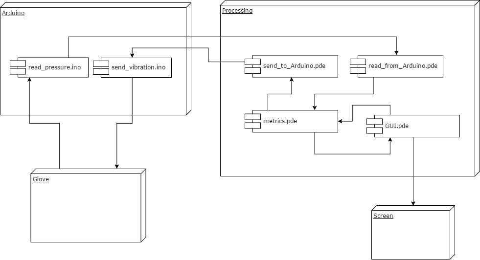

# Glovezz

Creators: Aniel Rossi, Francesc Lluis, Lorenzo Romanelli, and Tae Hun Kim 
***

Glovezz is a music rhythm game in which players use a glove to simulate playing piano across several music songs with different levels of difficulty. Players match notes that scroll on-screen to colored buttons by pressing the finger of the glove in time to the music in order to score points. The game attempt to mimic many features of playing a real piano and it also provides haptic feedback through the glove to aid piano players in self assessment.

  

This repository includes the code to play Glovezz. Specifically, it contains the code for controlling Arduino UNO, the serial communication between Arduino and Processing, and the graphical user interface. It should be noted that Arduino is attached to the glove, receiving sensor data and controlling vibration motors.

## Component Diagram

## Glove Design

## Game Design

The core gameplay of Glovezz is a rhythm game similar to Guitar Hero. The glove controller is mandatory to play, although in a future we will provide a standard keyboard controller to be used instead.

While playing the game, the "note highway" is shown vertically on the screen and as the song progresses, colored markers indicating notes travel down the screen in time with the music; the note colors and positions match those of the five fingers on the glove. Once the note(s) reach the bottom, the player must play the indicated note(s) by going down with the correct finger and hitting the floor in order to score points. Success or failure will cause the on-screen meter to change, showing how well the player is playing (denoted by green and green sections). Notes can be a single note, or composed of two to five notes that make a chord.  Both single notes and chords can also be played with more or less pressure which is indicated by the intensity of the color marker.

## Evaluation Methods

## Arduino-Processing Serial Protocol
